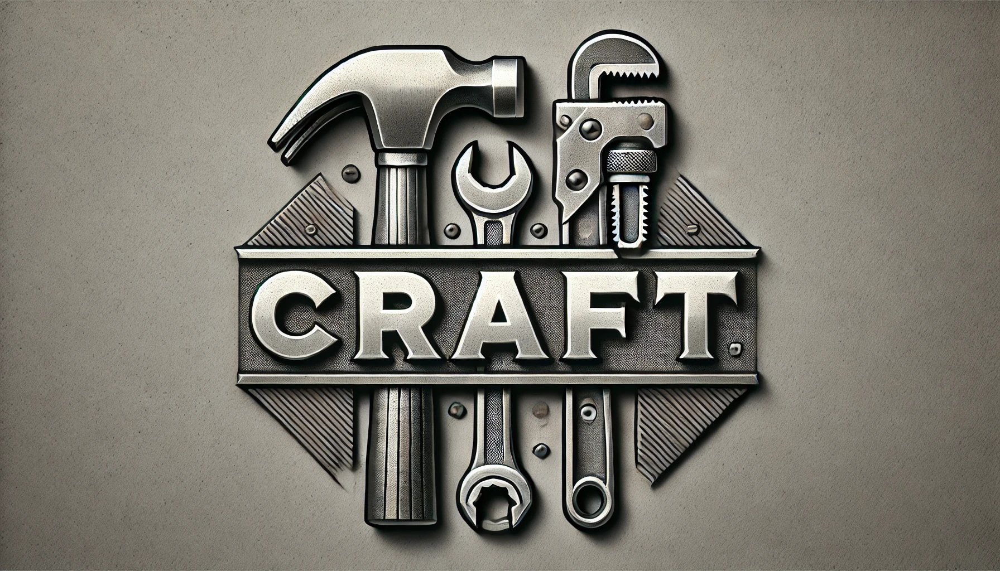
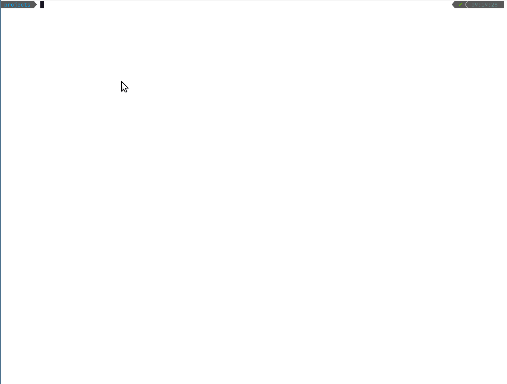
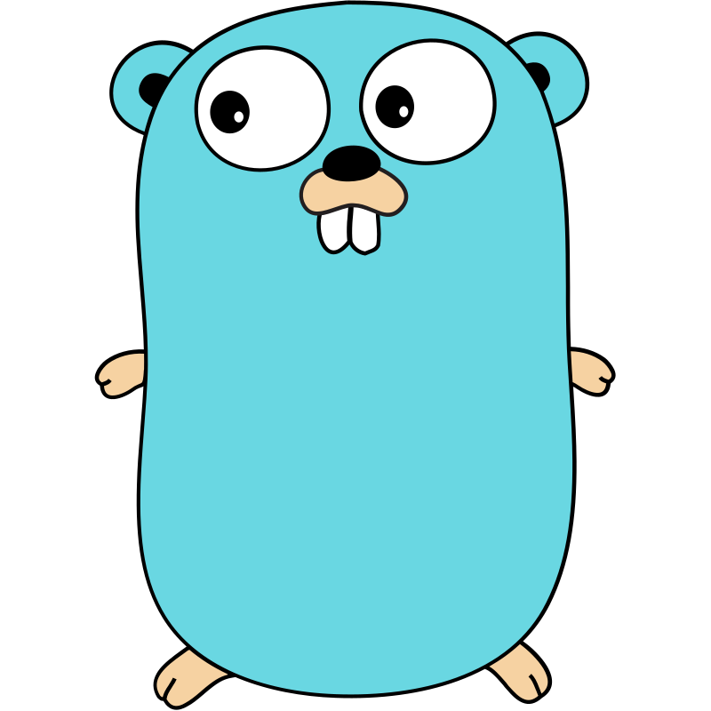
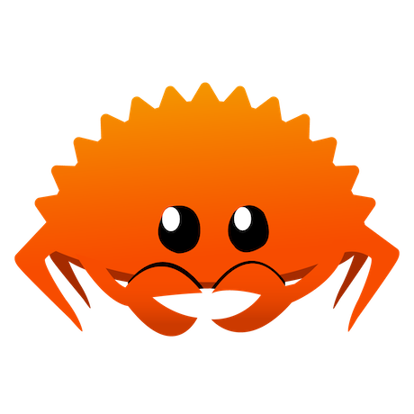

---
# **Craft CLI Tool**



## **Overview**
The `Craft` CLI is a tool designed to simplify the process of bootstrapping new projects by generating boilerplate code for various languages and frameworks.

- 🛠️ **Simplifies Project Bootstrapping**: Generates boilerplate code for various languages and frameworks.  
- 🐳 **Docker-Ready**: All projects are designed to run in Docker containers, allowing you to create and use them without installing the required language.
- 🌐 **Multi-Language Support**: Works with Go, Java, and other supported languages.  
- 🏎️ **Small and Fast**: A lightweight CLI tool designed for quick execution.  
- 💡 **Efficient and Reliable**: Helps you start and maintain projects effortlessly.  
- 🏗️ **Almost no dependencies**: Requires only docker, curl and unzip to build and run your projects. There's no need to install any other language runtimes, compilers, or frameworks locally.

See how `Craft` solves the [problems of other scaffolding tools](#️-problems-with-other-scaffolding-tools) where I explain how it addresses common pitfalls and inefficiencies.

## **Table of Contents**

- [Problems with Other Scaffolding Tools](#️-problems-with-other-scaffolding-tools)
- [Why Use Craft](#️-why-use-craft)
- [Features](#features)
- [Installation](#installation)
- [Command Line Usage](#command-line-usage)
  - [Creating New Projects](#creating-new-projects)
- [Dependencies](#dependencies)
- [Supported Languages](#supported-languages)
- [Craft Templates Configuration and Contribution Guide](#craft-templates-configuration-and-contribution-guide)
  - [For Contributors to the Official Craft Templates Repository](#for-contributors-to-the-official-craft-templates-repository)
    - [Branch Naming Conventions](#branch-naming-conventions)
  - [Customizing Template URLs](#customizing-template-urls)
- [License](#license)


---
## ⚠️ Problems with Other Scaffolding Tools

While exploring new languages or starting small projects, I encountered several issues with existing scaffolding tools:

1. **Language-Specific Tools**: Existing tools are often tied to a single language, limiting flexibility for multi-language workflows.  
2. **Language or Runtime-Specific Dependencies**: Most tools require the target language or its runtime to be installed on the machine, making setup cumbersome.
3. **Complex Projects**: These tools often generate large, interconnected setups that can be overwhelming for beginners or unnecessary for small tasks.  
4. **No Dockerized Setup**: Few tools create a containerized environment, making it harder to run the created projects in isolated and consistent environments.

These problems slow down productivity, create barriers for quickly experimenting with a new language or solving coding challenges, and result in projects that do not run in a containerized, isolated setup.
  - Running projects in Docker containers ensures consistency by providing a uniform environment across systems, eliminating 'it works on my machine' issues, isolating dependencies, and enabling easy cleanup or switching between projects without affecting the host system. ([see Docker](https://www.docker.com/))

---

## 🛠️ Why Use Craft?

- **Dockerized Development**: Automatically creates a containerized environment for every project, so you don’t need the language or runtime installed on your machine.
- **Lightweight and Fast**: Runs as a binary on unix systems (no support for windows), ensuring fast execution without much additional dependencies required on your host ([see dependencies](#dependencies)).
- **Multi-Language Support**: Works seamlessly across multiple languages, making it versatile for various tasks.
- **Minimal Setup**: Generates only the essential files needed to start coding, with the option to create more complex setups if you’re familiar with the language. This allows you to build and structure your project the way you want.
- **Beginner-Friendly**: Focuses on simplicity and clarity, giving you exactly what you need to get started with a new language or task.

## ✨Features

- **Project Scaffolding** (`new` command):
  - Quickly generate project files and structure for supported languages and frameworks.
  - Automatically creates a new directory named `craft-<language>` for every project.
  - Specify dependencies for projects using the `--dependencies` flag.

- **Docker-Ready**:
  - Generated and updated projects are pre-configured to run in Docker containers.

---

## 📥 Installation

1. Clone the repository:
   ```bash
   git clone https://github.com/VincentVanCode101/craft.git
   cd craft
   ```

2. Install the binary:
   ```bash
   ./install.sh
   ```
  - Linux: the binary is automatically added to `/usr/local/bin/craft`
  - MacOS: the binary is automatically added to `/opt/homebrew/bin/craft`
---


## 💻 Command Line Usage

### 1. Creating New Projects

Generate a new project by specifying the language:
```bash
craft new <language>
```

#### Options:
- **`--path`**: Specify a path for the new project with the last path segment being the name of the project.
- **`--dependencies`**: Specify the dependencies or project type (e.g., `--dependencies=maven,spring`).
- **`--level`**: Specify the complexity of the project setup. Allowed values are:
  - **`build`**: Provides an enhanced setup which may include additional tools like pre-commit hooks.
  - **`prod`**: Sets up a production-ready project with multi-stage Dockerfile builds and other production optimizations.
  - (If omitted, the default level is implicitly `dev`, which typically creates a basic development container providing only a minimal runtime environment.)
- **`--quiet`**: To control verbosity of the output: only display error messages.
- **`--verbose`**: To control verbosity of the output: enable verbose output (debug messages enabled).
- **`--debug`**: To control verbosity of the output: enable super-debug mode (verbose output with shell tracing).
- **`--show-dependencies`**: Show supported dependencies for the specified language.

---

#### Examples:

1. **Display the help information for Craft:**
   ```bash
   craft -h
   ```
   


2. **Display help for the `new` command:**
   ```bash
   craft new -h
   ```

3. **Generate a new Go project:**
   ```bash
   craft new go
   ```

4. **Generate a new Python project with verbose logging (double verbose) and dependencies _flask_ and _sqlalchemy_:**
   ```bash
   craft new python -vv --dependencies=flask,sqlalchemy
   ```

5. **Generate a new Java project in quiet mode:**
   ```bash
   craft new java -q
   ```

6. **Generate a new Java project with production-level setup, including dependencies _mariadb_ and _ncurs_, and specify the project path:**
   ```bash
   craft new java --dependencies=mariadb,ncurs --level=prod --path=~/projects/java_app
   ```
   

7. **Show supported dependencies for the Java language:**
   ```bash
   craft new java --show-dependencies
   ```

---
## Dependencies
- [Docker](https://www.docker.com/)
- [Curl](https://wiki.ubuntuusers.de/cURL/)
- [Unzip](https://www.tecmint.com/install-zip-and-unzip-in-linux/)


# 🌐Supported Languages

<h2 style="display: flex; align-items: center; gap: 10px; font-size: 2rem; font-weight: bold; line-height: 1;">
  Go 
</h2>

<details>
<summary>more</summary>

#### Allowed Operations:
  - `new`: Create a new Go project ([Documentation](./docs/go.md)).
  
#### **Examples**:
1. Create a new Go project with the name `my-go-project`:
   ```bash
   craft new go --path=my-go-project
   ```

2. Create a new Go project with the dependency `ncurses`:
   ```bash
   craft new go --path=my-go-project --dependencies=ncurses
   ```


</details>

<h2 style="display: flex; align-items: center; gap: 10px; font-size: 2rem; font-weight: bold; line-height: 1;">
  Java 
</h2>

<details>
<summary>more</summary>

- **Allowed Build Tools and Frameworks**:
  - **Maven**:
    - `default`: Create a Java projects without any specific dependencies will setup a plain java project with maven as the build tool. ([Documentation](./docs/java-maven-default.md))

    **Example**:
   Create a new Java project using Maven:
    ```bash
    craft new java
    ```
    - `quarkus`: Create a Java projects with the Quarkus framework. ([Documentation](./docs/java-quarkus.md))

    **Example**:
   Create a new Quarkus-Java project using Maven:
    ```bash
    craft new java --dependencies=quarkus
    ```
    - `springboot`: Coming soon...


</details>

<h2 style="display: flex; align-items: center; gap: 10px; font-size: 2rem; font-weight: bold; line-height: 1;">
  Rust 
</h2>

<details>
<summary>more</summary>

#### Allowed Operations:
  - `new`: Create a new Rust project ([Documentation](./docs/rust.md)).
  
#### **Examples**:
1. Create a new Rust project with the name `my-rust-project`:
   ```bash
   craft new rust --path=my-rust-project
   ```

</details>


---

# Craft Templates Configuration and Contribution Guide
---
## For Contributors to the Official Craft Templates Repository

The official Craft Templates repository is located at:  
[https://github.com/VincentVanCode101/craft-templates](https://github.com/VincentVanCode101/craft-templates)


## Customizing Template URLs

Since Craft looks up the template archive URL by reading the environment variable that matches the constructed templates key, you can easily change where the templates are hosted by updating your .env file. For example, if you want to use a different URL for a `Go` project with `prod` settings and dependencies `ncurs` and `mariadb`, update your `.env` file as follows:

```bash
TEMPLATES_URL_go_prod_mariadb_ncurs="https://your.custom.domain/path/to/your/templates.zip"
```
This setup gives you full flexibility to modify or redirect the source of template archives without changing any Craft code.

## **📜License**

Licensed under [MIT License](./LICENSE)